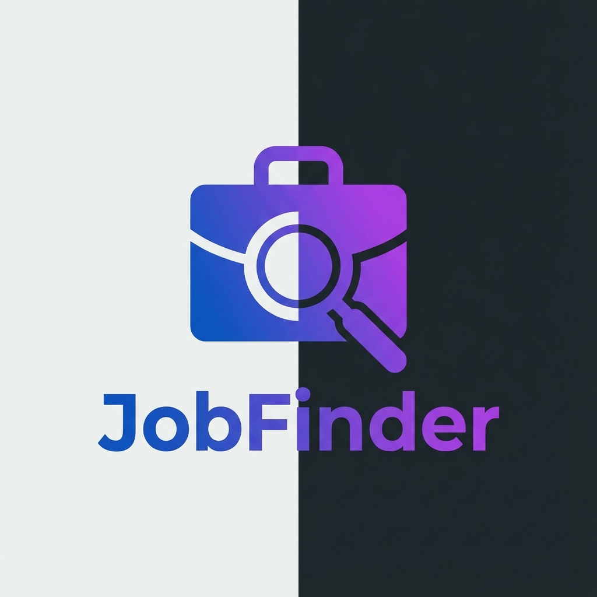

# 🎯 JobFinder - Your All-in-One Job Search Platform

**Search thousands of jobs from multiple platforms in one place!**

[🌐 Visit Website](https://jobfiner.netlify.app) • [📧 Contact Us](https://jobfiner.netlify.app/contact) • [❓ FAQ](https://jobfiner.netlify.app/faq)

---

## 📖 Overview

**JobFinder** is a comprehensive job search aggregator that brings together opportunities from the world's leading job platforms into one convenient location. Save time and discover more opportunities by searching Indeed, LinkedIn, Google Jobs, and ZipRecruiter simultaneously.

### 🌟 **Live Demo:** [jobfiner.netlify.app](https://jobfiner.netlify.app)

---

## ✨ Features

### 🔍 **Multi-Platform Search**
- Search across **4 major job platforms** simultaneously
- **Indeed**, **LinkedIn**, **Google Jobs**, and **ZipRecruiter**
- See thousands of jobs in one unified interface

### ⚡ **Real-Time Results**
- Get the latest job postings updated in real-time
- No delays, no outdated listings
- Fresh opportunities as soon as they're posted

### 🎯 **Advanced Filtering**
- Filter by job site/platform
- Filter by experience level (Fresher, Mid-level, Senior)
- Filter by job type (Full-time, Part-time, Contract)
- Filter by work mode (Remote, Hybrid, On-site)

### 📊 **Export Functionality**
- Download search results as CSV
- Organize your job applications offline
- Track opportunities in your preferred system

### 📱 **Mobile Responsive**
- Works perfectly on all devices
- Desktop, tablet, and smartphone compatible
- Search on the go!

### 🆓 **Completely Free**
- No registration required
- No subscription fees
- No hidden costs
- Always free for job seekers

---

## 🖥️ How It Works

1. **Enter Your Search** - Type in your desired job title and location
2. **We Search Everywhere** - Our system queries multiple job platforms simultaneously
3. **Review Results** - Browse aggregated results with detailed job information
4. **Apply Directly** - Click on any job to be redirected to the original posting

---

## 🛠️ Technology Stack

**Frontend:**
- React.js with Vite
- Modern, responsive UI/UX
- TailwindCSS for styling

**Backend:**
- Python FastAPI
- Job aggregation APIs
- Real-time data processing

**Deployment:**
- Frontend: Netlify
- Backend: Render
- 99.9% uptime guarantee

**Features:**
- EmailJS integration for contact form
- CSV export functionality
- Advanced filtering system
- SEO optimized

---

## 📄 Pages

- **🏠 [Home](https://jobfiner.netlify.app/)** - Search for jobs
- **ℹ️ [About](https://jobfiner.netlify.app/about)** - Learn about JobFinder
- **❓ [FAQ](https://jobfiner.netlify.app/faq)** - Frequently asked questions
- **📧 [Contact](https://jobfiner.netlify.app/contact)** - Get in touch
- **🔒 [Privacy Policy](https://jobfiner.netlify.app/privacy)** - How we protect your data
- **📋 [Terms of Service](https://jobfiner.netlify.app/terms)** - Terms and conditions

---

## 🎯 Use Cases

### **For Job Seekers:**
- Find your dream job faster
- Access more opportunities
- Save time searching
- No need to visit multiple websites

### **For Students:**
- Find entry-level and fresher positions
- Discover internships
- Begin your career journey

### **For Professionals:**
- Explore career advancement opportunities
- Find remote work options
- Compare positions across platforms

---

## 📊 Stats

| Metric | Value |
|--------|-------|
| Job Platforms | 4+ |
| Available Jobs | Thousands Daily |
| Cost | Free Forever |
| Uptime | 99.9% |
| Mobile Friendly | ✅ Yes |

---

## 🔒 Privacy & Security

- ✅ No registration required - start searching immediately
- ✅ We don't store personal information
- ✅ GDPR compliant
- ✅ Secure HTTPS connection
- ✅ Your data is safe

Read our [Privacy Policy](https://jobfiner.netlify.app/privacy) for details.

---

## 📱 Contact & Support

### **Need Help?**
- 📧 **Email:** sivareddyevuri92@gmail.com
- 🌐 **Website:** [jobfiner.netlify.app](https://jobfiner.netlify.app)
- 📝 **Contact Form:** [Send us a message](https://jobfiner.netlify.app/contact)

### **Social Media:**
- 💼 **LinkedIn:** [Connect with us](#)
- 🐦 **Twitter:** [Follow us](#)
- 👥 **Facebook:** [Like our page](#)

---

## ❓ Frequently Asked Questions

### **Is JobFinder really free?**
Yes! JobFinder is completely free for job seekers. No registration, no subscription, no hidden costs.

### **How often are jobs updated?**
Jobs are fetched in real-time when you search, ensuring you always see the most current listings.

### **Can I apply through JobFinder?**
JobFinder aggregates job listings. When you find a position you like, clicking on it takes you directly to the original posting where you can apply.

### **Which platforms do you search?**
We currently search Indeed, LinkedIn Jobs, Google Jobs, and ZipRecruiter.

### **Do I need to create an account?**
No! You can start searching immediately without any registration.

**More questions?** Visit our [FAQ page](https://jobfiner.netlify.app/faq)

---

## 🏆 Why Choose JobFinder?

| Feature | JobFinder | Traditional Job Search |
|---------|-----------|----------------------|
| Multiple Platforms | ✅ 4+ platforms | ❌ One at a time |
| Time Saving | ✅ 1 search = all results | ❌ Repeat searches |
| Cost | ✅ Free forever | ⚠️ Some charge fees |
| Registration | ✅ Not required | ⚠️ Often required |
| Mobile App | ✅ Responsive web | ⚠️ Varies |
| Export Results | ✅ CSV download | ❌ Usually not available |

---

## 📜 License

**© 2026 JobFinder. All Rights Reserved.**

This is a proprietary web application. The source code is **private and confidential**.

**Unauthorized copying, modification, distribution, or reverse engineering is strictly prohibited.**

For licensing inquiries or partnership opportunities, please [contact us](https://jobfiner.netlify.app/contact).

---

## 🚀 Roadmap

### **Coming Soon:**
- [ ] Save favorite jobs (bookmark feature)
- [ ] Job alerts via email
- [ ] Resume builder tool
- [ ] Salary comparison tool
- [ ] Company reviews integration
- [ ] Cover letter generator
- [ ] Interview preparation guides

---

## 📈 Project Status

| Component | Status |
|-----------|--------|
| Website | ✅ Live |
| Job Search API | ✅ Active |
| Multi-platform Search | ✅ Working |
| Export Feature | ✅ Available |
| Mobile Support | ✅ Optimized |
| SEO | ✅ Optimized |

---

## 🌟 Acknowledgments

Built with modern web technologies to help job seekers find opportunities faster and more efficiently.

Special thanks to:
- React.js community
- FastAPI framework
- All job platforms for making their listings accessible

---

## 📞 Get In Touch

**Have questions? Want to collaborate? Found a bug?**

We'd love to hear from you!

- 📧 **Email:** sivareddyevuri92@gmail.com
- 🌐 **Website:** [jobfiner.netlify.app](https://jobfiner.netlify.app)
- 📝 **Contact Form:** [Click here](https://jobfiner.netlify.app/contact)

---

**Made with ❤️ for Job Seekers Everywhere**

[🌐 Visit Website](https://jobfiner.netlify.app) • [📧 Contact](https://jobfiner.netlify.app/contact) • [❓ FAQ](https://jobfiner.netlify.app/faq)

⭐ **If you find this useful, spread the word!**

---

### 📝 Note

This README is for **public documentation purposes only**. The actual source code is maintained in a **private repository**.

For business inquiries, partnerships, or licensing: sivareddyevuri92@gmail.com
